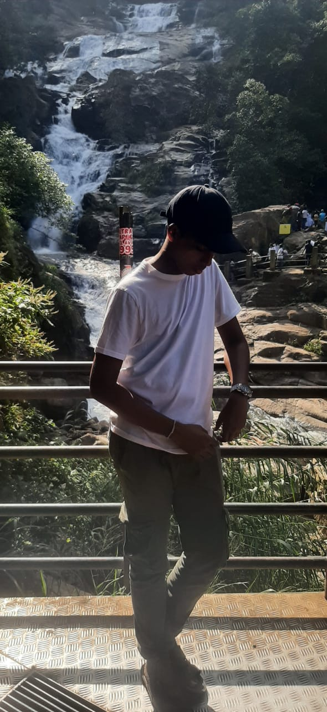

# Rusith Welisara — Professional Portfolio



A high-performance, aesthetically driven portfolio showcasing the work of **Rusith Welisara**, a 16-year-old systems engineer, AI architect, and robotics developer from Sri Lanka.

## 🚀 Vision
Building production-grade AI systems, physical robots, and platform architectures that push the boundaries of what's possible with consumer-grade hardware. Inspired by the engineering philosophies of NASA, Tesla, and Nvidia.

## 🛠️ Tech Stack
- **Frontend:** React.js, Vite, Vanilla CSS (Modern UI/UX)
- **AI/ML:** Whisper.cpp (STT), Piper (TTS), Ollama (LLMs), YOLOv8 (Vision), MediaPipe
- **Robotics & Embedded:** Arduino, Bluetooth Mesh Networks (BLE), Multi-device sensor networks
- **Systems:** Modular agent architectures, Offline-first logic, Cross-platform automation

## ⚡ Key Projects
- **Forge:** Next-gen AI-powered 2D/2.5D game engine.
- **DupliVerse:** Personal AI operating system for life automation.
- **JARVIS:** Fully offline voice/vision assistant with head-tracked holographic display.
- **Mesh Chat:** Decentralized Bluetooth/Wi-Fi chat system for laboratory environments.

## 📖 Philosophy
> *"If technology can be built, I'll build it—even if my hardware is trash and the world thinks it's impossible."*

## 💻 Development Setup

This portfolio is built with **React + Vite** and focuses on high-performance animations and glassmorphism design.

```bash
# Clone the repository
git clone https://github.com/RusithWelisara/professional-portfolio.git

# Install dependencies
npm install

# Run development server
npm run dev

# Build for production
npm run build
```

## 📬 Contact & Collaboration
- **Email:** [rusithwelisara@gmail.com](mailto:rusithwelisara@gmail.com)
- **GitHub:** [github.com/RusithWelisara](https://github.com/RusithWelisara)
- **LinkedIn:** [Coming Soon]

---
*© 2025 Rusith Welisara. Built with precision and future-focus.*